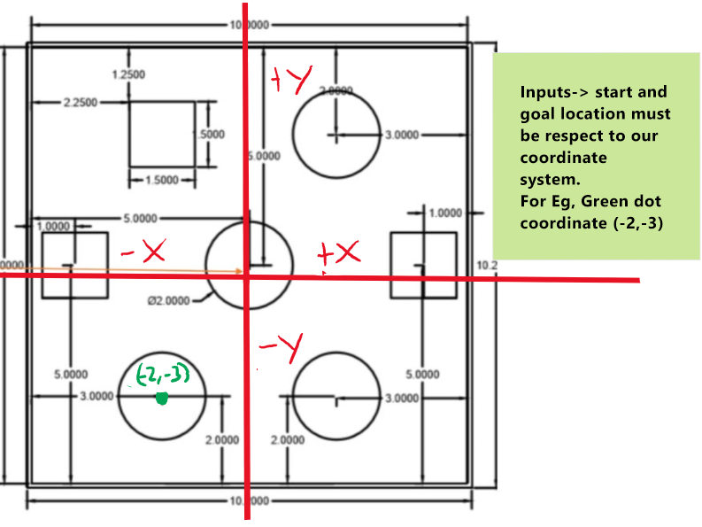
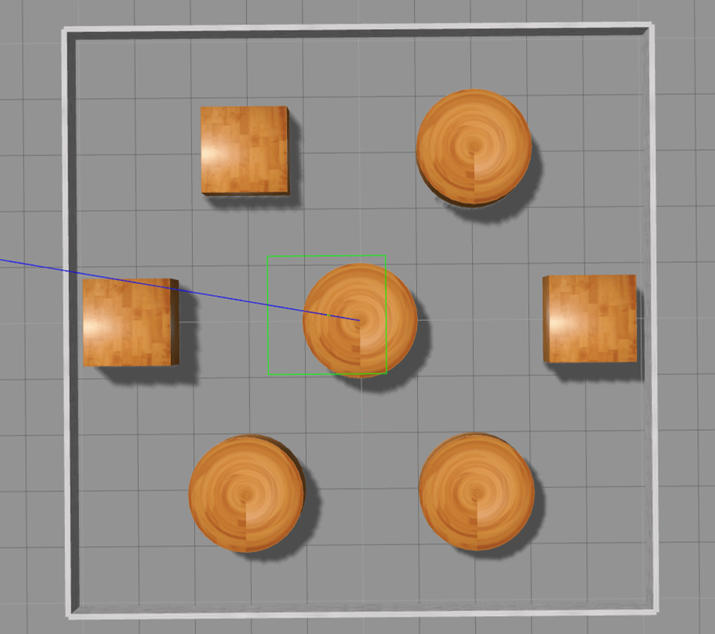

# Phase-3
## A*-algorithm implementation with Differential constainsts of the turtlebot
### Description
In this project, A* algorithm is implemented considering the differential contraints of the turtle bot. We are considering the rigid robot to be the turtlebot. The action set of the rigid robot is determined using the left and right wheel velocities which are provided as inputs by the user. In addition to that, constaints are added to the action set by determining the equations of the motion of the turtlebot.

### Obstacle space

### Actions
The actions of the robot are determined by left and right wheel angular velocities(ul,ur) given by the user.

### Dependencies and libraries
1. python -version 3
2. pygame
3. Numpy


### INPUT PARAMETERS

#### UL and UR
From the velocity equation,


if the angular velocities of the wheels(U) are really small, then the robot will have a really small velocity.
For U = 10, v becomes roughly 0.19m/s. However this is further reduced as v is multiplied by cos and sin of angles. Therefore,
v becomes roughly 0.1m/s. 

In general,  
U=max(Ul,Ur) = 10 -> max(v) = 0.1m/s -> NB These are rough estimates and not exact   
U=max(Ul,Ur) = 20 -> max(v) = 0.3m/s

The turtlebot can have a maximum value of 0.65m/s. This translates to a U value of roughly 34. 
For values of U below 10, the turtlebot may be even slower than a tortoise. **It is advisable to enter values in the range
such that U=max(Ul,Ur) is in the range (10,34).**

#### START AND GOAL COORDINATES
The start and goal coordinates must be with respect to the coordinate system as stated above. Do not use gazebo or image coordinates.


### Run Code
Enter the following to run the code.

```
git clone https://github.com/mesneym/Differential-Drive-PP.git
cd [to 'Differential-Drive-PP' directory]
python3 code/main.py
```

**NB Run the code from the differential-drive-pp directory.** The code will not work if in any other directory
because of the relative path to files

### Input Instruction:
As soon as you run the program, the following prompt occurs in the command window:
```
Robot considered is Turtlebot 2:
Enter cleareance
0.5
Enter start location s1 between -5 and 5 - (X-coordinate of start node)
-4
Enter start location s2 between -5 and 5 - (Y-coordinate of start node)
4
Enter the angle of the robot in degrees - (intial orientation of the robot)
0
Enter goal location g1 between -5 and 5 - (X-coordinate of goal node)
0
Enter goal location g2 between -5 and 5 - (Y-coordinate of goal node)
-3
```

### SAMPLE OUTPUT FOR RIGID ROBOT
After running the python file
```
Cost took to reach the goal is: 395.64675298172733
Backtracking...
Total time taken 128.9800910949707
```

### Video

# Phase-4:
In phase 4, we implement A* algorithm on turtlebot by simulating it on gazebo using ROS.

<!--### Gazebo world:-->
<!--The turtlebot obstacle space in gazebo is given below:-->
<!---->

### Dependencies 
1. python -version 2.7
2. python -version 3
3. Gazebo
4. ROS

### Run the code:
Follow the instructions in phase 3 to run the Astar code.
```
cd Differential-Drive-PP
python3 code/main.py
```
**run the code in the Differential-Drive-PP directory**.The code will not work as we are using relative path to files
to read necessary parameters.

Now change the python version to python 2.7
```
cd Differential-Drive-PP/catkin_ws
catkin_make
cd ..
source catkin_ws/devel/setup.bash
rosrun turtlebot_astar run.sh
```
**run the code in the Differential-Drive-PP directory**.The code will not work as we are using relative path to files
to read necessary parameters.

Now open another terminal and run the following code.
```
cd Differential-Drive-PP
source catkin_ws/devel/setup.bash 
rosrun turtlebot_astar talker.py 
```
**run the code in the Differential-Drive-PP directory**.The code will not work as we are using relative path to files
to read necessary parameters.

