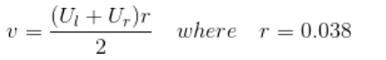

# Phase-3
## A*-algorithm implementation with Differential constainsts of the turtlebot
### Description
In this project, A* algorithm is implemented considering the differential contraints of the turtle bot. We are considering the rigid robot to be the turtlebot. The action set of the rigid robot is determined using the left and right wheel velocities which are provided as inputs by the user. In addition to that, constaints are added to the action set by determining the equations of the motion of the turtlebot.

### Obstacle space

### Actions
The actions of the robot are determined by left and right wheel angular velocities(ul,ur) given by the user.

### Dependencies and libraries
1. python -version 3
2. pygame
3. Numpy


### Input Parameters

#### Ul and Ur
From the velocity equation,



if the angular velocities of the wheels(U) are really small, then the robot will have a really small velocity.
For U = 10, v becomes roughly 0.19m/s. However this is further reduced as v is multiplied by cos and sin of angles. Therefore,
v becomes roughly 0.1m/s. 

In general,  
U=max(Ul,Ur) = 10 implies max(v) = 0.1m/s -> NB These are rough estimates and not exact   
U=max(Ul,Ur) = 20 implies max(v) = 0.3m/s

The turtlebot can have a maximum value of 0.65m/s. This translates to a U value of roughly 34. 
For values of U below 10, the turtlebot may be even slower than a tortoise. **It is advisable to enter values in the range
such that U=max(Ul,Ur) is in the range (10,34).**

**The maximum possible values for both Ul and Ur is [4.4, 34].** By entering values below 4.4, the code will output 'Path can't be generated'. This happens because the code constantly checks for the distance beween the current and the next point to be greater than 0.1. If this condition is not satisfied, the next point is disregarded. When the user enter velocities below 4.4, the distance between the current and the next point will always be less than 0.1. Hence, all the points are disregarded. 

#### Precision Parameters: 
The precision parameters considered in this code are:

##### Time Step dt
1. The time step affects the optimal path in the sense that it affects the distance between the two inputs, clearly from the 
update equation,  


Using a big value for dt, means that the newpoints,(xn,yn) are going to farther away from oldpoints(xo,yo) and **this in turn affects the optimal
path as there could be suitable path generated for smaller dt** .   

**By default, a dt value of 0.3 is used.** However, you can modify this can be modified

##### 2. Smoothing coefficient  
Similary, the smoothing coefficient,k determines the angle change between two points. From the update equation we 
have,


using small values of k means that the change in angle between successive points is reduced. This helps to remove sharp turns. The **default value** used is **0.5**, however this can be changed. **NB Just like the Time step,dt, changing the smoothing cooefficient affects the optimal path**


#### Start and Goal Coordinates
The start and goal coordinates must be with respect to the coordinate system as stated above. Do not use gazebo or image coordinates.


### Run Code
Enter the following to run the code.

```
git clone https://github.com/mesneym/Differential-Drive-PP.git
cd [to 'Differential-Drive-PP' directory]
python3 code/main.py
```

**NB Run the code from the differential-drive-pp directory.** The code will not work if in any other directory
because of the relative path to files

### Input Instruction:
As soon as you run the program, the following prompt occurs in the command window:
```
Robot considered is Turtlebot 2:
Enter cleareance
0.5
Enter start location s1 between -5 and 5 - (X-coordinate of start node)
-4
Enter start location s2 between -5 and 5 - (Y-coordinate of start node)
-4
Enter the angle of the robot in degrees - (intial orientation of the robot)
0
Enter goal location g1 between -5 and 5 - (X-coordinate of goal node)
0
Enter goal location g2 between -5 and 5 - (Y-coordinate of goal node)
-3
Enter left wheel rotational velocity between 4.4 and 34
20
Enter right wheel rotational velocity between 4.4 and 34
20
Enter smooth Coef or negative value for default paramater
-1
Enter Time step or negative value for default paramater
-1

```

### SAMPLE OUTPUT 


# Phase-4:
In phase 4, we implement A* algorithm on turtlebot by simulating it on gazebo using ROS.

<!--### Gazebo world:-->
<!--The turtlebot obstacle space in gazebo is given below:-->
<!---->

### Dependencies 
1. python -version 2.7
2. python -version 3
3. Gazebo
4. ROS

### Run the code:
Follow the instructions in phase 3 to run the Astar code.
```
cd Differential-Drive-PP
python3 code/main.py
```
**run the code in the Differential-Drive-PP directory**.The code will not work if run in any other directory as we are using relative path to files
to read necessary parameters.

Now change the python version to python 2.7
```
cd Differential-Drive-PP/catkin_ws
catkin_make
cd ..
source catkin_ws/devel/setup.bash
rosrun turtlebot_astar run.sh
```

### Video output:
To test the results of pygame on turtlebot,**different smoothing coefficient and time step** was used as opposed to the default setup. 
This was because  the points are close together for the default values. As a result, it was difficult for the turtlebot to 
follow the desired path.

**First video Parameters:**
<pre>
<b>Start coordinates</b>: (-4,-3),<b>Start orientation</b>: 0, <b>Goal coordinates</b>: (0,-3), <b>clearance</b>: 0.3   
<b>dt</b> = 0.6, <b>smoothing coefficient</b> = 0.2, <b>Left wheel velocity</b> : 20, <b>Right wheel velocity</b> : 20
</pre>
**First video output:**

 


**Second video Parameters:**
Using different smoothing coefficient and time step dt, changes the optimal path as compared to the default case.
<pre>
<b>Start coordinates</b>: (-4,-4),<b>Start orientation</b>: 0, <b>Goal coordinates</b>: (4,2.5), <b>clearance</b>: 0.3   
<b>dt</b> = 0.8, <b>smoothing coefficient</b> = 0.1, <b>Left wheel velocity</b> : 20, <b>Right wheel velocity</b> : 20
</pre>


**Second video output:**


To access full video please click on this [link](https://drive.google.com/drive/folders/1r2lyCS7f3MUi0458xqHsil_6RG9Ynp4d?usp=sharing)
